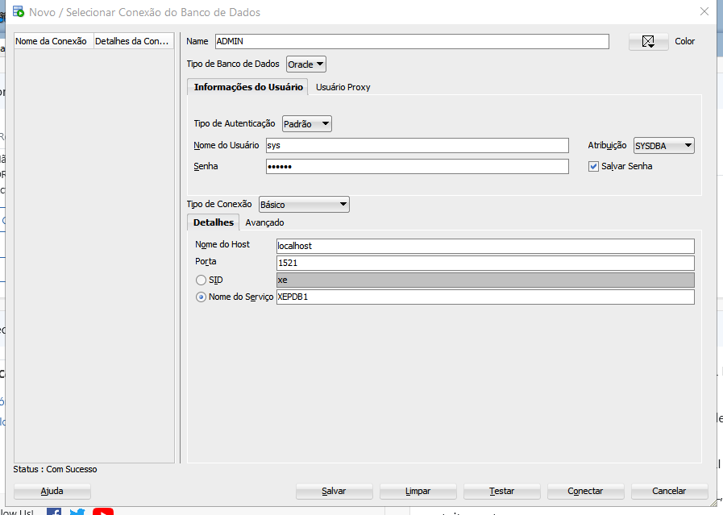

# Instalando o Banco de Dados Oracle

Entre no link abaixo e realize o download do Express Edition:

Oracle DataBase XE

https://www.oracle.com/database/technologies/appdev/xe.html

Depois baixe o SQL Developer, no link:
https://www.oracle.com/database/sqldeveloper/technologies/download/

Depois de realizar o download de ambos,
instale o Banco de Dados Oracle, e posteriormente abra o SQL Developer e realize essas instruções:

Entre no SQL Developer e conecte com o usuário sys do banco de dados:

Este usuário será o responsável em realizar todas as conexões com o seu banco de dados:

