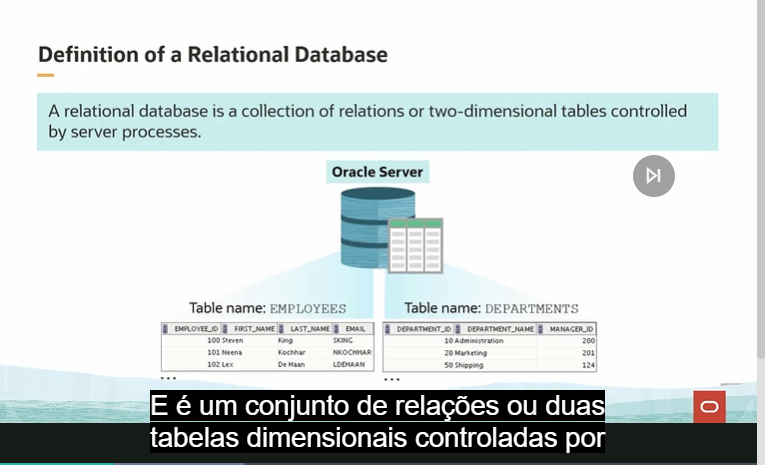
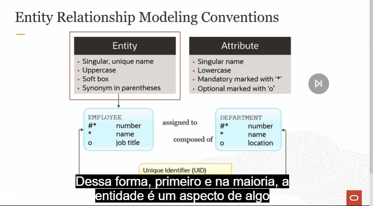

# SQL

## O que é SQL?

**SQL (Structured Query Language)** é uma linguagem de consulta estruturada utilizada para manipular e gerenciar bancos de dados relacionais.

Sua principal função é fornecer recursos para criação, manipulação, consulta e controle de bancos de dados.

O SQL trabalha com dados em **nível lógico** e segue o padrão **ANSI SQL**, sendo suportado pela maioria dos bancos de dados relacionais.

---

# As 4 categorias da linguagem SQL

## DML - Data Manipulation Language
### Linguagem de Manipulação de Dados

A **DML** é responsável pela manipulação dos dados armazenados nas tabelas.

### Principais comandos

| Comando | Função |
|---------|---------|
| `INSERT` | Insere novos registros |
| `UPDATE` | Atualiza registros existentes |
| `DELETE` | Remove registros |
| `MERGE` | Insere ou atualiza registros conforme uma condição |

> **Observação:** Em algumas referências o comando `SELECT` é tratado separadamente (DQL), embora muitas documentações o agrupem junto à DML.

---

## DDL - Data Definition Language
### Linguagem de Definição de Dados

A **DDL** é utilizada para criar e modificar a estrutura do banco de dados.

### Principais comandos

| Comando | Função |
|---------|---------|
| `CREATE` | Cria objetos (tabelas, índices, views etc.) |
| `ALTER` | Modifica objetos existentes |
| `DROP` | Remove objetos |
| `RENAME` | Renomeia objetos |
| `TRUNCATE` | Remove todos os registros de uma tabela sem apagar sua estrutura |
| `COMMENT` | Adiciona comentários em objetos do banco |

---

## DCL - Data Control Language
### Linguagem de Controle de Dados

A **DCL** é utilizada para controlar as permissões de acesso ao banco de dados.

### Principais comandos

| Comando | Função |
|---------|---------|
| `GRANT` | Concede permissões aos usuários |
| `REVOKE` | Remove permissões concedidas |

---

## TCL - Transaction Control Language
### Linguagem de Controle de Transações

A **TCL** é responsável pelo controle das transações realizadas no banco de dados, garantindo sua integridade.

### Principais comandos

| Comando | Função |
|---------|---------|
| `COMMIT` | Confirma definitivamente uma transação |
| `ROLLBACK` | Desfaz uma transação |
| `SAVEPOINT` | Cria um ponto de restauração dentro de uma transação |

---

# Ferramentas para trabalhar com SQL

## Oracle SQL Developer

Ferramenta gráfica da Oracle utilizada para:

- Executar comandos SQL;
- Desenvolver e depurar códigos PL/SQL;
- Criar objetos do banco de dados;
- Importar e exportar dados;
- Administrar bancos Oracle.

---

## SQL*Plus

O **SQL*Plus** é uma interface de linha de comando da Oracle.

Suas principais características:

- Execução interativa de comandos SQL e PL/SQL;
- Execução de scripts em lote;
- Administração de bancos Oracle;
- Também ficou conhecido por sua versão web chamada **iSQL*Plus**.

---

## Oracle JDeveloper

O **Oracle JDeveloper** é um ambiente de desenvolvimento (IDE) voltado principalmente para aplicações Java.

Além disso, permite:

- Executar instruções SQL;
- Desenvolver aplicações que utilizam banco Oracle;
- Depurar códigos SQL e PL/SQL;
- Trabalhar com Web Services e aplicações Java.

---

## Oracle Application Express (Oracle APEX)

O **Oracle APEX** é uma plataforma de desenvolvimento web de baixo código (*Low-Code*).

Com ela é possível:

- Desenvolver aplicações web rapidamente;
- Criar interfaces para bancos Oracle;
- Implantar aplicações diretamente no ambiente Oracle;
- Gerenciar dados através de uma interface gráfica.

---

# Resumo das Linguagens SQL

| Categoria | Nome | Finalidade |
|-----------|------|------------|
| **DML** | Data Manipulation Language | Manipulação dos dados |
| **DDL** | Data Definition Language | Definição da estrutura do banco |
| **DCL** | Data Control Language | Controle de permissões |
| **TCL** | Transaction Control Language | Controle de transações |

# Conceito de tabela relacional

Em uma empresa existe funcionário, e dependendo do setor e sua função na empresa ele terá uma remuneração específica, por isso existe o Banco de Dados relacional, que relaciona coisas que estão interligadas.
 

Para que seja possível criar o modelo correto, precisamos entender as regras do negócio.

Após entender isso, é possível criarmos as modelagens de dados baseadas nas convenções:

