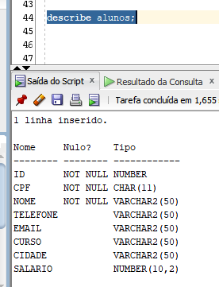
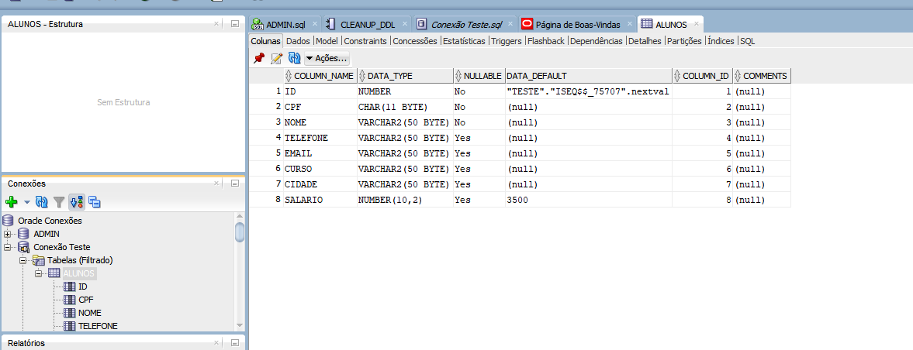

## DESCRIBE: Para que serve?

O describe como o proprio nome sugere, informa toda a estrutura da tabela.

Se realizarmos em nossa tabela alunos, ele irá descrever cada coluna e o tipo de caracter esperado por cada uma.

Resumo, se você quiser conhecer como é uma estrutura de uma tabela, use o **describe**.

Outra forma de você conhecer a estrutura da tabela é indo o canto superior esquerdo, clicando no botão + que irá aparecer a tela:

