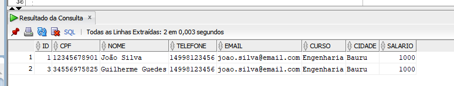
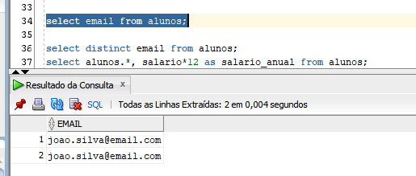
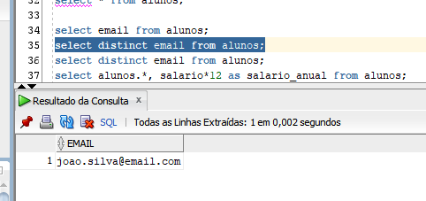

## DISTINCT: Para que serve?

O distinct serve para você trazer dados de uma tabela que não estão duplicados, por exemplo:


Realizamos um
```sql
select * from alunos;
```
Para trazer todos os dados:


Note que o email está duplicado, se eu passar a instrução:

```sql
select email from alunos;
```
Ele traz todos os e-mails para mim:


Agora se eu passar um **distinct**, ele irá trazer somente uma informação:




