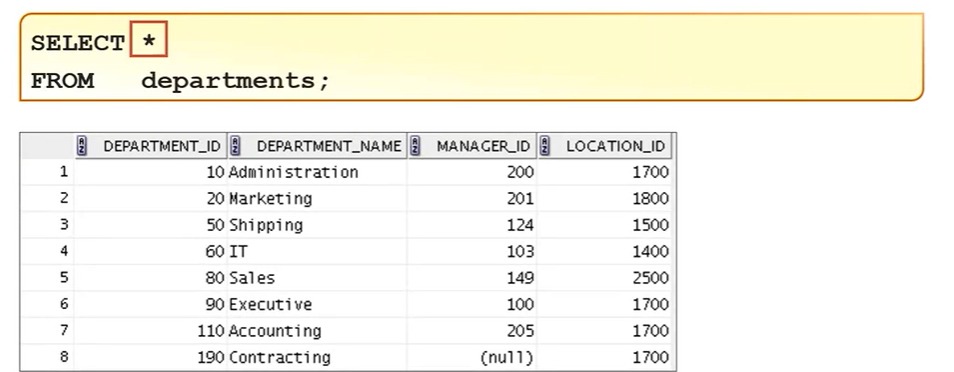

# Como funciona o select

o select serve para vc identificar as colunas que serão exibidas

# from: Para que usar o 'from'

O from serve para identificar a tabela que será exibida

# * : E o asterisco para que serve?

O Asterisco (*) serve para informar que você quer listar todas as colunas de uma tabela.

Exemplo:

