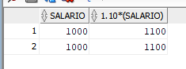

## Como realizar calculos dentro do Banco de Dados Oracle?

https://docs.oracle.com/en/database/oracle/oracle-database/26/sqlrf/ALTER-TABLE.html#GUID-552E7373-BF93-477D-9DA3-B2C9386F2877__I2054940

Exemplo:

```sql
select nome, salario, 12*salario*100 from alunos;
```
No comando acima, os salários de todos os alunos serão multiplicados por 12 e acrescidos o valor de 100 no valor final.


## Realizando uma simulação de dissídio

Suponhamos que uma empresa quer realizar um dissídio para vários funcionários, e precisa realizar através de um script SQL, como você realizaria?

```sql
select salario, 1.10*(salario) from alunos;
```
No comando acima, ele traz toda a informação de salário que há no Banco de Dados, e lhe mostra como irá ficar após o calculo que você inseriu:



Entretanto, ele não altera o valor inserido, só lhe informa como irá ficar.

