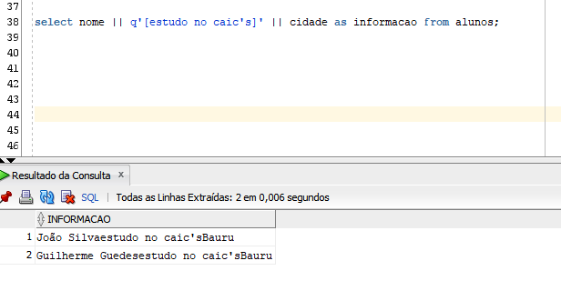

# AS: Para que serve o AS?

O As serve para deixar o nome da saída, mais bonito

Exemplo, sabemos que temos uma tabela com as informações:
```sql
1	12345678901	João Silva	14998123456	joao.silva@email.com	Engenharia	Bauru	1000
3	34556975825	Guilherme Guedes	14998123456	joao.silva@email.com	Engenharia	Bauru	1000
```
Se quisermos calcular o salario anual por exemplo, podemos inserir a seguinte instrução:

```sql
select 
nome,
salario,
salario *12 as "salario anual"
from alunos;
```

O AS significa alias, que tem como tradução:

"também conhecido como"

No exemplo acima, será retornado o valor abaixo:



