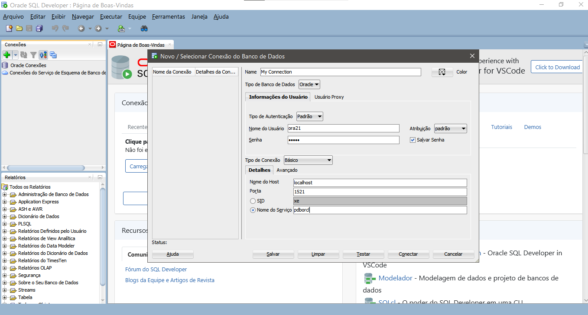

## SQL Server

Como baixar o Sql server?

Entre no link abaixo:
https://www.oracle.com/database/sqldeveloper/technologies/download/

Depois instale o .exe e realize as configurações abaixo:

Para que essa tela apareça, lembre de clicar no botão verde superior a esquerda.